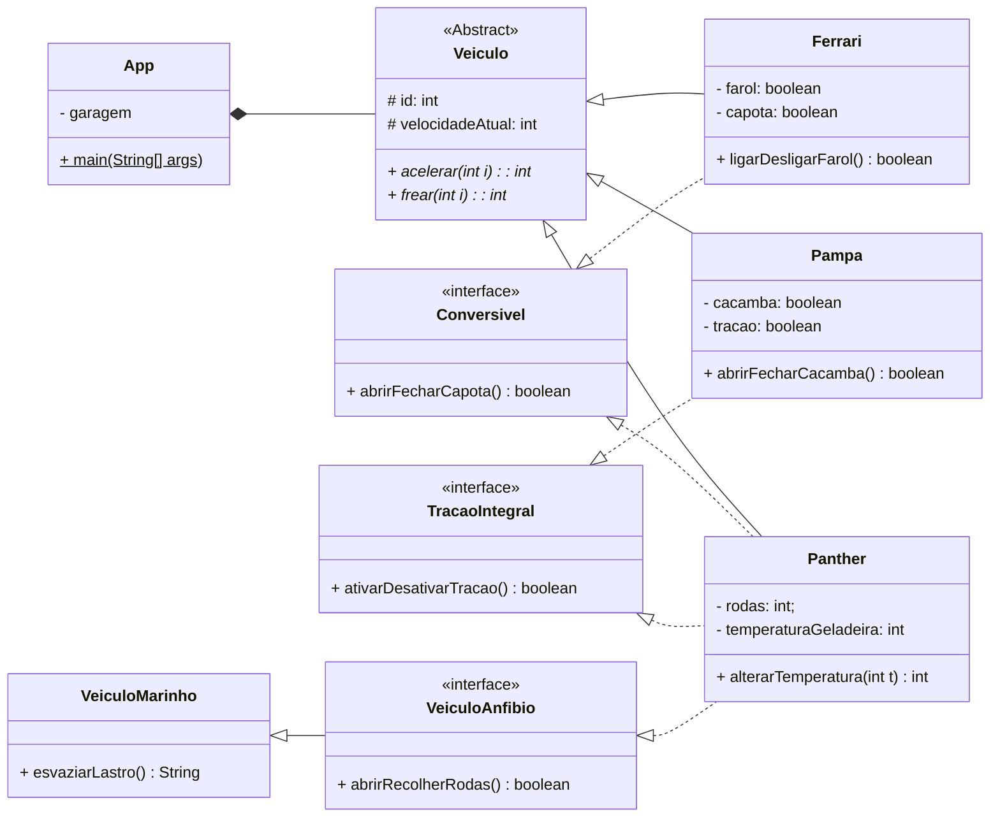

# Diagrama de Classes

```mermaid

classDiagram
    
    direction LR
    
    class App {
        
        - garagem
        
        + main(String[] args) $
        
    }
    
    class Veiculo {
        <<Abstract>>
        
        # id: int
        # velocidadeAtual: int
        
        + acelerar(int i): int *
        + frear(int i): int *
        
    }
    
    class Ferrari {
        
        - farol: boolean
        - capota: boolean
        
        + ligarDesligarFarol() boolean
        
    }
    
    class Pampa {
        
        - cacamba: boolean
        - tracao: boolean
        
        + abrirFecharCacamba() boolean
        
    }
    
    class Panther {
        
        - rodas: int;
        - temperaturaGeladeira: int
        
        + alterarTemperatura(int t) int
        
    }
    
    class Conversivel {
        <<interface>>
        
        + abrirFecharCapota() boolean
    }
    
    class TracaoIntegral {
        <<interface>>
        
        + ativarDesativarTracao() boolean
        
    }
    
    class VeiculoAnfibio {
        <<interface>>
        
        + abrirRecolherRodas() boolean
        
    }
    
    class VeiculoMarinho {
        
        + esvaziarLastro() String
        
    }
    
    App *-- Veiculo
    Veiculo <|-- Ferrari
    Veiculo <|-- Pampa
    Veiculo <|-- Panther
    Conversivel <|.. Ferrari
    Conversivel <|.. Panther
    TracaoIntegral <|.. Pampa
    TracaoIntegral <|.. Panther
    VeiculoAnfibio <|.. Panther
    VeiculoMarinho <|-- VeiculoAnfibio
    
    
    
    
    
    

```