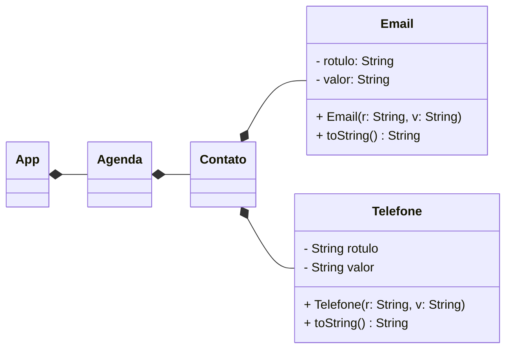

#Diagrama de Classes

```mermaid

classDiagram
    
    direction LR

class App {
    
}

class Agenda {
    
}

class Contato {
    
}

class Email {
    - rotulo: String
    -  valor: String
    
    + Email(r: String, v: String)
    + toString() String
    
    
}

class Telefone {
    - String rotulo
    - String valor
    
    + Telefone(r: String, v: String)
    + toString() String
    
}

App *-- Agenda
Agenda *-- Contato
Contato *-- Email
Contato *-- Telefone

```