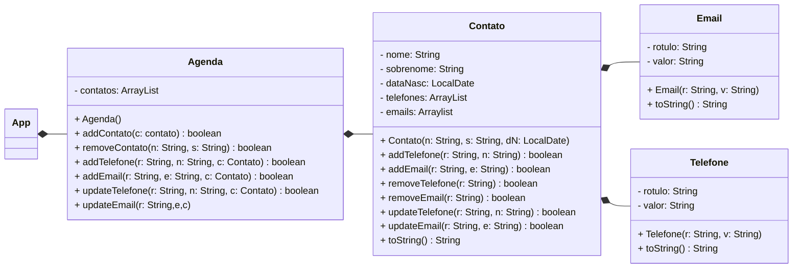

#Diagrama de Classes

```mermaid

classDiagram
    
    direction LR

class App {
    
}

class Agenda {
    - contatos: ArrayList<Contato>
    
    + Agenda()
    + addContato(c: contato) boolean
    + removeContato(n: String, s: String) boolean
    + addTelefone(r: String, n: String, c: Contato) boolean
    + addEmail(r: String, e: String, c: Contato) boolean
    + updateTelefone(r: String, n: String, c: Contato) boolean
    + updateEmail(r: String,e,c)
    
}

class Contato {
    - nome: String
    - sobrenome: String
    - dataNasc: LocalDate
    - telefones: ArrayList<Telefone>
    - emails: Arraylist<Email>
    
    + Contato(n: String, s: String, dN: LocalDate)
    + addTelefone(r: String, n: String) boolean
    + addEmail(r: String, e: String) boolean
    + removeTelefone(r: String) boolean
    + removeEmail(r: String) boolean
    + updateTelefone(r: String, n: String) boolean
    + updateEmail(r: String, e: String) boolean
    + toString() String
    
}

class Email {
    - rotulo: String
    -  valor: String
    
    + Email(r: String, v: String)
    + toString() String
    
    
}

class Telefone {
    - rotulo: String
    - valor: String
    
    + Telefone(r: String, v: String)
    + toString() String
    
}

App *-- Agenda
Agenda *-- Contato
Contato *-- Email
Contato *-- Telefone

```