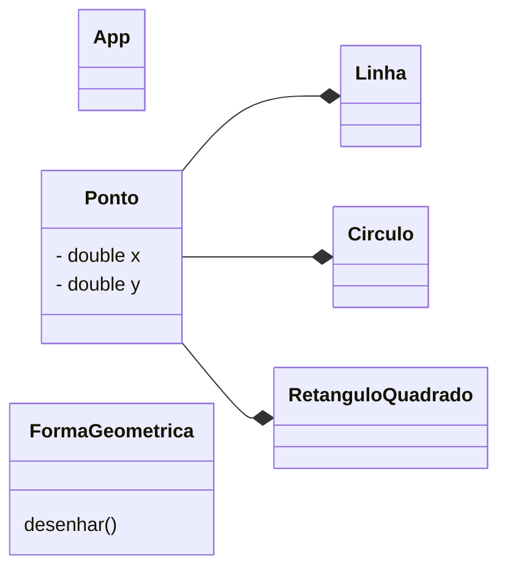

# Diagrama de Classes

```mermaid

classDiagram
    
    direction LR
    
    class App {
        
    }
    
    
    
    
    
    
    
    class Ponto {
        - double x
        - double y
    }
    
    class Linha {
        
    }
    
    class FormaGeometrica {
        desenhar()
    }
    
    class Circulo {
        
    }
    
    class RetanguloQuadrado {
        
    }
    
    
    Ponto --* Linha
    Ponto --* Circulo
    Ponto --* RetanguloQuadrado


```