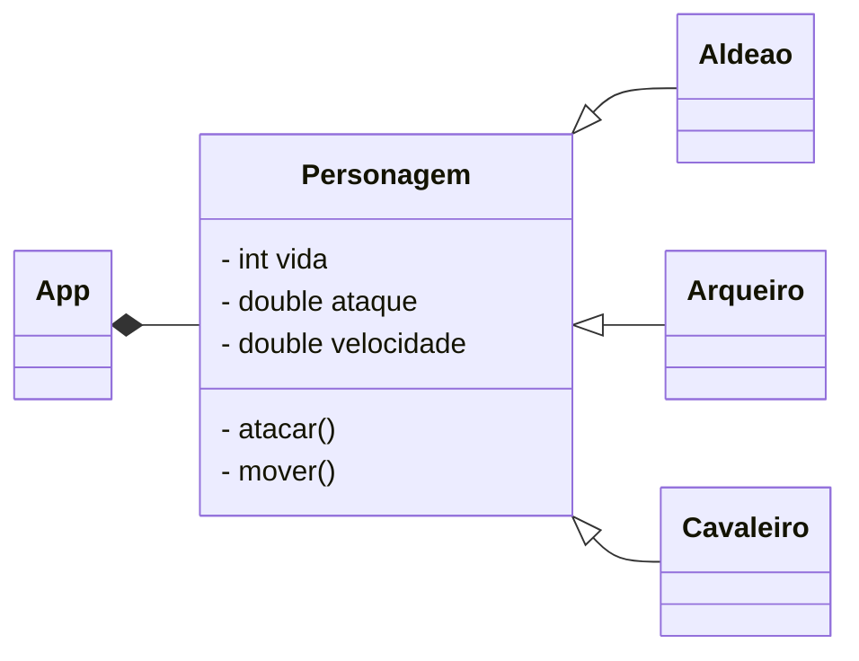

# Diagrama

```mermaid

classDiagram
    
    direction LR
    
    class App {
        
    }
    
    class Personagem {
        
        - int vida
        - double ataque
        - double velocidade
        
        - atacar()
        - mover()
    }
    
    class Aldeao {
        
    }
    
    class Arqueiro {
        
    }
    
    class Cavaleiro {
        
    }
    
    App *-- Personagem
    Personagem <|-- Aldeao
    Personagem <|-- Arqueiro
    Personagem <|-- Cavaleiro


```