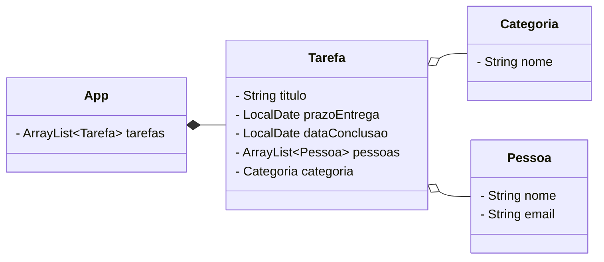

# Markdown

```mermaid

classDiagram
    
    direction LR
    
    class App {
        - ArrayList~Tarefa~ tarefas
    }
    
    class Tarefa {
        - String titulo
        - LocalDate prazoEntrega
        - LocalDate dataConclusao
        - ArrayList~Pessoa~ pessoas
        - Categoria categoria
    }
    
    class Categoria {
        - String nome
    }
    
    class Pessoa {
        - String nome
        - String email
    }
    
    App *-- Tarefa
    Tarefa o-- Categoria
    Tarefa o-- Pessoa


```