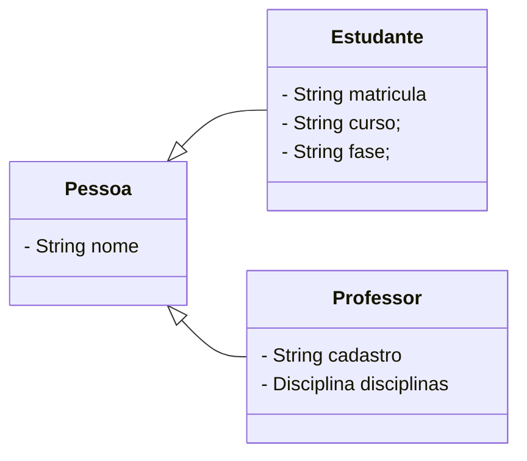

# Diagrama 1

```mermaid

classDiagram
    
    direction LR
    
    class Pessoa {
        - String nome
    }
    
    class Estudante {
        - String matricula
        - String curso;
        - String fase;
    }
    
    class Professor {
        - String cadastro
        - Disciplina disciplinas
    }
    
    Pessoa <|-- Estudante
    Pessoa <|-- Professor


```