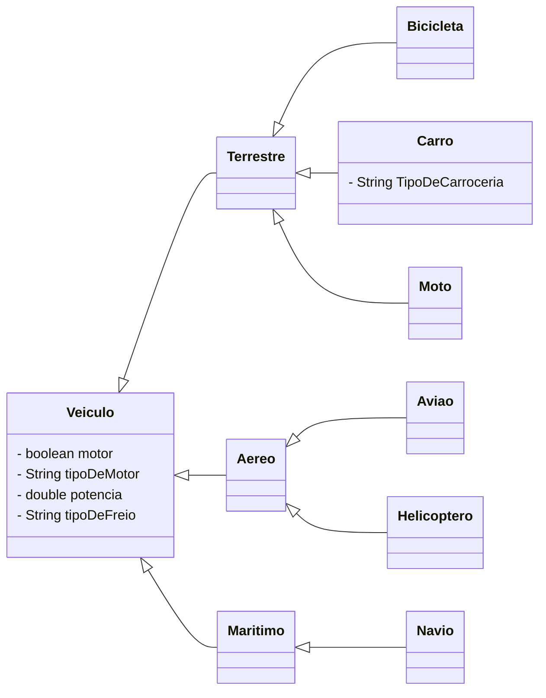

# Diagrama 2

```mermaid

classDiagram
    
    direction LR
    
    class Veiculo {
        - boolean motor
        - String tipoDeMotor
        - double potencia
        - String tipoDeFreio
    }
    
    class Terrestre {
        
    }
    
    class Aereo {
        
    }
    
    class Maritimo {
        
    }
    
    class Bicicleta {
        
    }
    
    class Carro {
        - String TipoDeCarroceria
    }
    
    class Moto {
        
    }
    
    class Navio {
        
    }
    
    class Aviao {
        
    }
    
    class Helicoptero {
        
    }
    
    Veiculo <|-- Terrestre
    Veiculo <|-- Aereo
    Veiculo <|-- Maritimo
    Terrestre <|-- Bicicleta
    Terrestre <|-- Carro
    Terrestre <|-- Moto
    Maritimo <|-- Navio
    Aereo <|-- Aviao
    Aereo <|-- Helicoptero
    
    
    
    
  
    
    


```