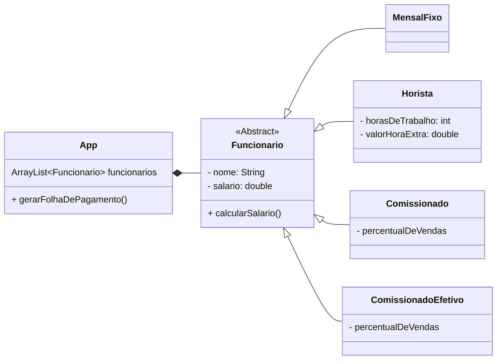

# Diagrama

```mermaid

classDiagram
    
    direction LR
    
    class App {
        ArrayList~Funcionario~ funcionarios
        
        + gerarFolhaDePagamento()
    }
    
    class Funcionario {
        <<Abstract>>
        - nome: String
        - salario: double
        
        + calcularSalario()
            
    }
    
    class MensalFixo {
        
    }
    
    class Horista {
        - horasDeTrabalho: int
        - valorHoraExtra: double
    }
    
    class Comissionado {
        - percentualDeVendas
    }
    
    class ComissionadoEfetivo {
        - percentualDeVendas
        
    }
    
    App *-- Funcionario
    Funcionario <|-- MensalFixo
    Funcionario <|-- Horista
    Funcionario <|-- Comissionado
    Funcionario <|-- ComissionadoEfetivo
    
    


```