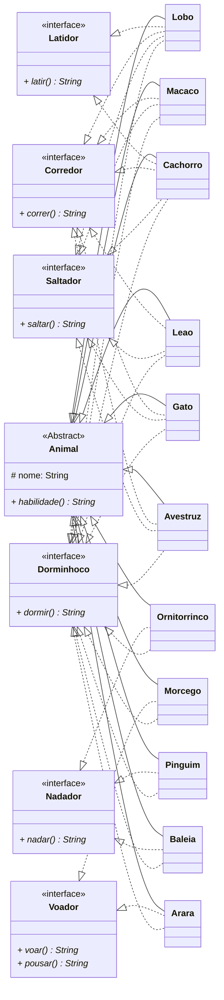

```mermaid

classDiagram
    
    direction LR
    
    class Animal {
        <<Abstract>>
        
        # nome: String
        
        + habilidade() String *
    }
    
    class Arara {
        
    }
    
    class Avestruz {
        
    }
    
    class Baleia {
        
    }
    
    class Cachorro {
        
    }
    
    class Gato {
        
    }
    
    class Leao {
        
    }
    
    class Lobo {
        
    }
    
    class Macaco {
        
    }
    
    class Morcego {
        
    }
    
    class Pinguim {
        
    }
    
    class Ornitorrinco {
        
    }
    
    Animal <|-- Arara
    Animal <|-- Avestruz
    Animal <|-- Baleia
    Animal <|-- Cachorro
    Animal <|-- Gato
    Animal <|-- Leao
    Animal <|-- Lobo
    Animal <|-- Macaco
    Animal <|-- Morcego
    Animal <|-- Pinguim
    Animal <|-- Ornitorrinco
    
    Latidor <|.. Cachorro
    Latidor <|.. Lobo
    
    Voador <|.. Arara
    Voador <|.. Morcego
    
    Nadador <|.. Baleia
    Nadador <|.. Pinguim
    Nadador <|.. Ornitorrinco
    
    Corredor <|.. Avestruz
    Corredor <|.. Cachorro
    Corredor <|.. Gato
    Corredor <|.. Leao
    Corredor <|.. Lobo
    Corredor <|.. Macaco
    
    Saltador <|.. Avestruz
    Saltador <|.. Cachorro
    Saltador <|.. Gato
    Saltador <|.. Leao
    Saltador <|.. Lobo
    Saltador <|.. Macaco

    Dorminhoco <|.. Arara
    Dorminhoco <|.. Avestruz
    Dorminhoco <|.. Baleia
    Dorminhoco <|.. Cachorro
    Dorminhoco <|.. Gato
    Dorminhoco <|.. Leao
    Dorminhoco <|.. Lobo
    Dorminhoco <|.. Macaco
    Dorminhoco <|.. Morcego
    Dorminhoco <|.. Pinguim
    Dorminhoco <|.. Ornitorrinco
    
    class Voador {
        <<interface>>
        
        + voar() String *
        + pousar() String  *
    }
    
    class Nadador {
        <<interface>>
        
        + nadar() String *
    }
    
    class Corredor {
        <<interface>>
        
        + correr() String *
    }
    
    class Saltador {
        <<interface>>
        
        + saltar() String *
    }
    
    
    class Latidor{
        <<interface>>
        
        + latir() String *
    }
    
    class Dorminhoco {
        <<interface>>
        
        + dormir() String *
    }
    
    


```