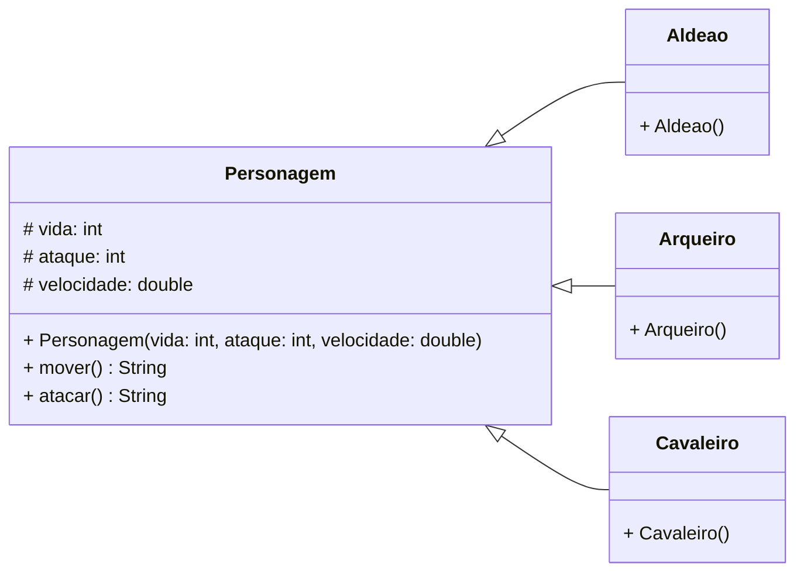

```mermaid

classDiagram
    
    direction LR
    
    class Personagem {
        # vida: int
        # ataque: int
        # velocidade: double
        
        + Personagem(vida: int, ataque: int, velocidade: double)
        + mover() String
        + atacar() String
    }
    
    class Aldeao {
        + Aldeao()
    }
    
    class Arqueiro {
        + Arqueiro()
    }
    
    class Cavaleiro {
        + Cavaleiro()
    }
    
    Personagem <|-- Aldeao
    Personagem <|-- Arqueiro
    Personagem <|-- Cavaleiro
    
    


```