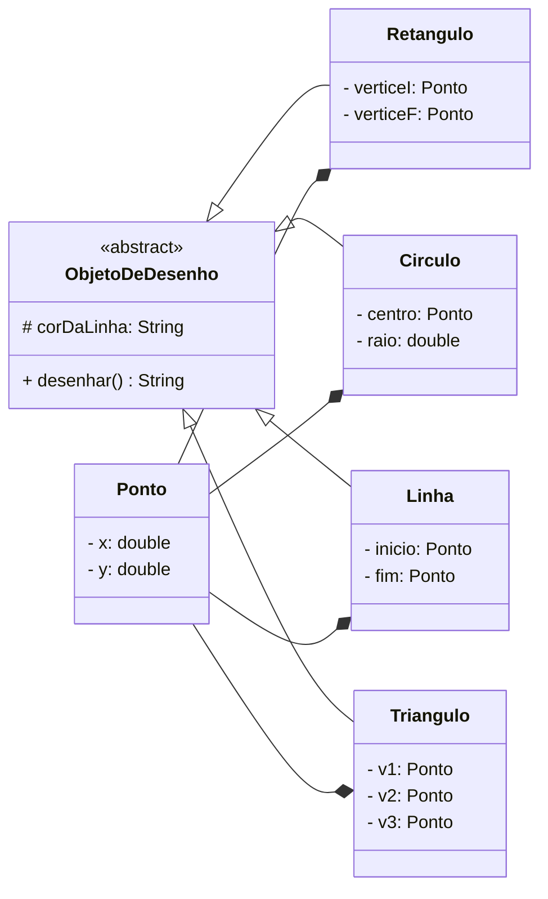

```mermaid

classDiagram
    
    direction LR
    
    class ObjetoDeDesenho {
        <<abstract>>
        # corDaLinha: String
        
        + desenhar() String
    }
    
    class Ponto {
        - x: double
        - y: double
    }
    
    class Linha {
        - inicio: Ponto
        - fim: Ponto
    }
    
    class Circulo {
        - centro: Ponto
        - raio: double
    }
    
    class Retangulo {
        - verticeI: Ponto
        - verticeF: Ponto
    }
    
    class Triangulo {
        - v1: Ponto
        - v2: Ponto
        - v3: Ponto
    }
    
    ObjetoDeDesenho <|-- Retangulo
    ObjetoDeDesenho <|-- Circulo
    ObjetoDeDesenho <|-- Linha
    ObjetoDeDesenho <|-- Triangulo
    Ponto --* Circulo
    Ponto --* Retangulo
    Ponto --* Linha
    Ponto --* Triangulo
    
    

```