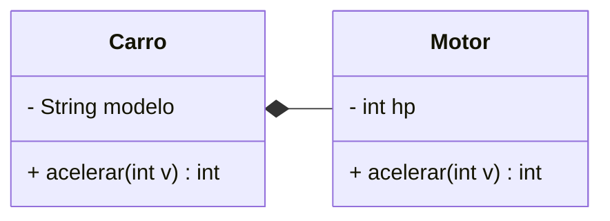

# DIagrama de classes UML

```mermaid
classDiagram
    
    direction LR
    
    class Carro{
        - String modelo
        + acelerar(int v) int
    }
    
    class Motor{
        - int hp
        + acelerar(int v) int
    }
    
    Carro *-- Motor
    
```